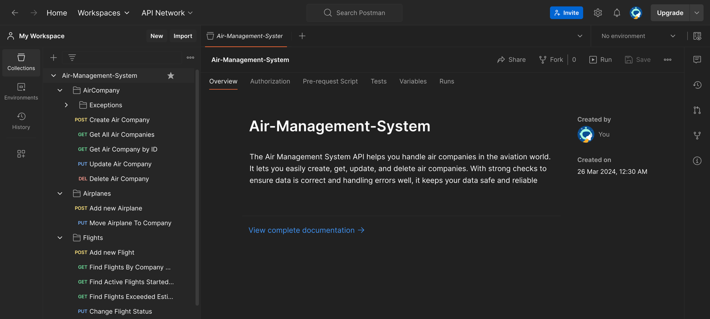
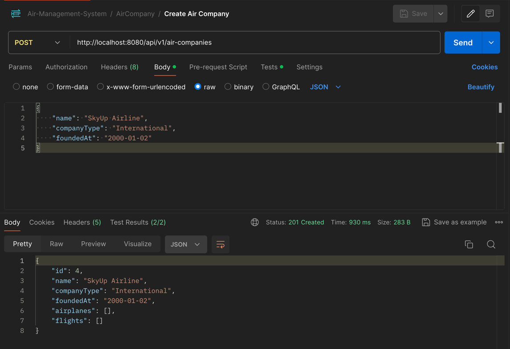
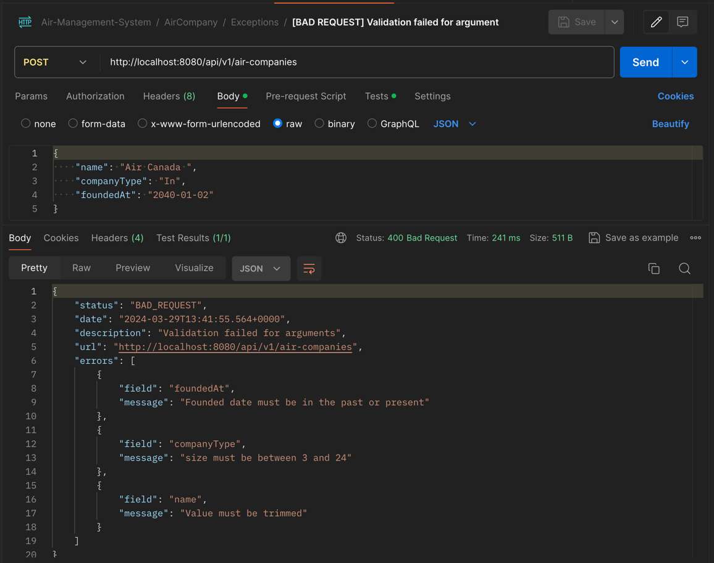

# Air Management System [Back-end]

The Air Management System API helps you handle air companies in the aviation world. It lets you easily create, get, update, and delete air companies. With strong checks to ensure data is correct and handling errors well, it keeps your data safe and reliable
### Technologies

- Spring 2.2.2.RELEASE
- Java 11
- MySQL
- Docker
- GIT

### Dev tools

- MapStruct
- Lombok

### How to run 🚀

To begin, you'll need to have this project installed on your computer.

### 1. Clone the Repository
``` git clone git@github.com:JessieCasey/Air-Management-System.git ```

``` cd AirManagementSystem/  ```

### 2. Run docker-compose.yml file
Make sure you have Docker installed on your computer. Then execute the following command to build the Spring Boot application and MySQL server:

``` docker compose up -d  ```

> ✉️ P.S. You might be wondering why we need the `wait-for-it.sh` script. The `Dockerfile` utilizes it to wait until the database is created. This script listens to the port to confirm that the database is ready. Although the `depends_on` command in `docker-compose.yml` checks if the MySQL server starts, it doesn't guarantee that the database is initialized. We require additional time to create a database before starting Spring Boot.
```
CMD ["./wait-for-it.sh", "db:3306", "--timeout=60", "--", "java", "-jar", "-Dspring.profiles.active=prod", "AirManagementSystem.jar"]
```
### Congratulations!

If you see the following message in the terminal, congratulations, you've completed everything correctly! 🎉
```
[+] Running 2/4
 ⠏ Network airmanagementsystem_backend-network  Created  1.8s 
 ⠧ Volume "airmanagementsystem_db_data"         Created  1.7s 
 ✔ Container airmanagementsystem-db-1           Started  1.2s 
 ✔ Container airmanagementsystem-backend-1      Started  1.4s
```

### 🌿 Start

Let's try making some requests. To do this, you'll need to have `Postman` installed. After installation, import the file `Air-Management-System.postman_collection.json`. Once imported, you should see something like this:



### ☀️ First Request
Let's attempt to send a request to the endpoint for creating an air company.

`http://localhost:8080/api/v1/air-companies`



### ⚙️ Exceptions Handling
The Spring Boot server is set up to manage and provide detailed exceptions in case of errors.

`http://localhost:8080/api/v1/air-companies`




### Exceptions Handling
- Making sure the input values are correct (like removing extra spaces, checking sizes, and ensuring dates are not in the future).
- Checking that names are unique using the @UniqueName annotation.
- Verifying that entities exist before performing operations on them.

### Configuration
This project uses different settings for development and production. You can find these settings in the `application.yml` file and its variations like `application-dev.yml` and `application-prod.yml`. 
Additionally, you can adjust application settings using constants defined in `ApplicationConstants`.

If you need sample data for testing, you can find it in the `data.sql` file.

### DurationToLongConverter Class

The `DurationToLongConverter` class improves how the program stores 
`Duration` objects in the database. By default, `Duration` is stored in nanoseconds, but this custom converter changes that to seconds. This optimization helps reduce memory usage and improves database performance.

###  Closing
To stop the Docker container:

```docker-compose down```


